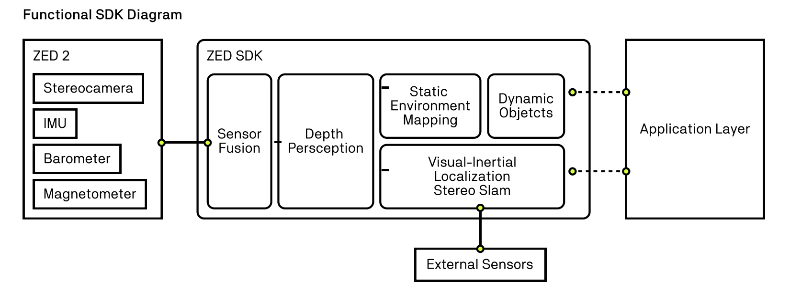
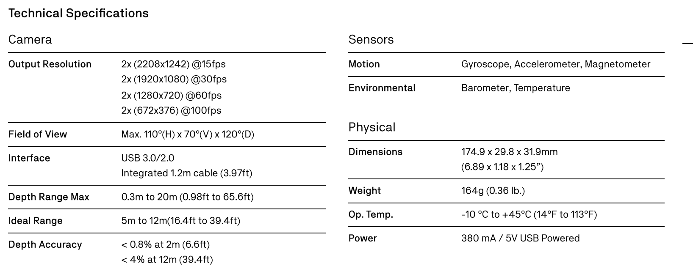

# ZED 2 Stereo Camera by Stereolabs

The **ZED 2 Stereo Camera** by Stereolabs is an advanced device designed for 3D perception and spatial understanding. It provides state-of-the-art features for a variety of applications, including robotics, autonomous navigation, and augmented reality.

## Features

### 1. **Spatial Object Detection**
- Utilizes advanced AI algorithms to detect, classify, and track objects in 3D space.
- Provides spatial positions and motion data for real-world objects.
- Applications: Robotics, autonomous navigation, augmented reality, etc.

### 2. **Natural Depth Sensing**
- Mimics human vision by generating accurate 3D depth maps in real-time.
- Captures fine details and provides natural depth perception.
- Applications: 3D mapping, obstacle detection, and surface reconstruction.

### 3. **All-Aluminium Case**
- Built with an all-aluminium body for durability, heat dissipation, and resistance to environmental impacts.
- Ensures reliable operation in outdoor and industrial environments.
- Provides structural stability to maintain consistent focal length and sensor performance.

### 4. **Built-in Sensor Stack**
- Includes an IMU, barometer, magnetometer, and temperature sensors.
- Enhances spatial awareness and environmental understanding.
- Applications: Drone navigation, autonomous vehicles, and industrial robotics.

### 5. **Camera Control**
- The ZED 2 is a UVC-compliant video camera offering low-level access to its settings.
- Control parameters include:
  - Exposure
  - Gain
  - Sharpness
  - White Balance
  - Frame Rate
  - Focus
- Applications: Robotics, AR/VR, and industrial inspection.

### 6. **Cloud Connected**
- Stream or store data in real-time to cloud platforms.
- Enables remote monitoring, real-time analytics, and collaborative robotics.
- Applications: IoT, remote surveillance, and data-driven workflows.

---

## Technical Details

### **Output Format**
- **YUV 4:2:2 - UYVY (8 bits):**
  - YUV color encoding separates luminance (Y) and chrominance (U and V) components.
  - **4:2:2 Chrominance Subsampling:**
    - Y (Luminance) is sampled at every pixel.
    - U and V (Chrominance) are sampled at half the horizontal resolution.
  - **UYVY Packing:**
    - Data for two pixels is stored as: `U0, Y0, V0, Y1`
    - Each component is 8 bits, making it 16 bits per pixel.
  - Applications: Video streaming, broadcasting, and stereo depth/color processing.

### **UVC Compliance**
- **USB Video Class (UVC):**
  - A standard protocol for video devices.
  - Plug-and-play compatibility with Windows, macOS, and Linux.
  - Works with software like OpenCV and OBS Studio.
- **Advantages:**
  - No proprietary drivers needed.
  - Standardized interface for seamless integration.

### **Low-Level Access**
- Provides granular control over camera hardware for professional users.
- Enables fine-tuning for specialized applications, such as:
  - Synchronization of multiple cameras.
  - Adjustments for challenging lighting conditions.
  - Optimization for computer vision algorithms.

---

## Use Cases

1. **Autonomous Vehicles:**
   - Handle rapid lighting changes with exposure and gain control.
   - Accurate depth sensing for obstacle avoidance.

2. **Robotics:**
   - Sharpness and focus adjustments ensure precise object detection and depth perception.

3. **AR/VR:**
   - Optimized white balance and exposure improve visual quality for immersive experiences.

4. **Industrial Inspection:**
   - Enhances defect detection with sharpness and contrast control.

---

## Images

### **SDK Diagram**

### **Technical Specifications**

---

## Summary
The ZED 2 Stereo Camera is a versatile and powerful tool, combining advanced spatial object detection, precise depth sensing, and robust hardware. Its UVC compliance and low-level access provide unparalleled flexibility for both general and specialized applications, making it a reliable choice for modern 3D perception tasks.
